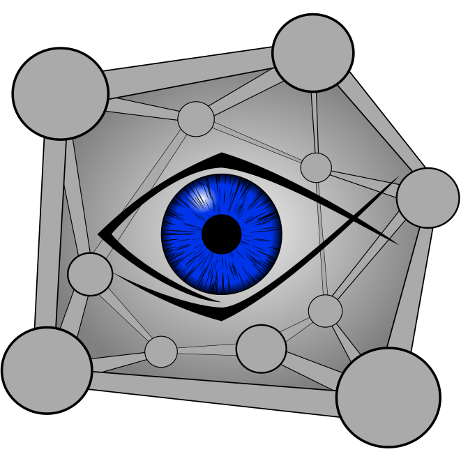

[//]: # ()


# vxPy

`vxPy` is a multiprocessing-based software for vision experiments in Python. 

It leverages OpenGL-based 3D graphics rendering, using the Python visualization library [VisPy](https://github.com/vispy/vispy), for dynamic generation and realtime updating of visual stimuli. `vxPy` utilizes multicore hardware for fast online aquisition and analysis of behavioral and other sensor data, as well as control of external devices, such as actuators or LEDs, via configurable microcontroller interfaces. 

This is the core package for `vxPy`. The accompanying application to configure and run the UI is hosted at [vxPy_app](https://github.com/thladnik/vxPy_app).

## Requirements

`vxPy` has been tested on Windows 10 and Ubuntu 20.04 and 22.04 LTS. It requires Python 3.8 or higher.

## Installation

### Installing Python

#### Windows
Download and install the Python 3.8+ binaries if not already installed from https://www.python.org/downloads/

#### Ubuntu

Install from canonical 
```console
user@machine: ~$ sudo apt-get install python3.x 
```

### Install vxPy with PyCharm (recommended)

TODO

### Install vxPy with terminal

#### Linux

Create a new folder where you'd like to install the vxPy application (here ~/vxPy_app/).
Using a terminal, create a virtual environment inside the empty folder 
```console
user@machine: ~/vxPy_app$ python3.x -m venv venv 
```

Activate the environment
```console
user@machine: ~/vxPy_app$ ./venv/bin/activate
```

Install vxPy with all its dependencies
```console
(venv) user@machine: ~/vxPy_app$ pip install git+https://github.com/thladnik/vxpy.git
```

Run vxPy setup to create application structure
```console
(venv) user@machine: ~/vxPy_app$ python -m vxpy setup
```
Alternatively, you can forego downloading sample files 
```console
(venv) user@machine: ~/vxPy_app$ python -m vxpy setup nosamples
```
**WARNING**: the demonstration in default.ini requires the sample files to run properly

You can run the default configuration with
```console
(venv) user@machine: ~/vxPy_app$ python main.py
```

## Compatible devices

### TheImagingSource (TIS) cameras
Under Windows [TIS](https://www.theimagingsource.de/) cameras are supported out of the box, using the TIS' original `tisgrabber` DLLs and their `ctype` bindings included in vxPy.

In order to use TIS cameras under Linux, you need to install `tiscamera` ([Github repository](https://github.com/TheImagingSource/tiscamera)) by following the instructions there. 

Within the Python environment, you then need to install `pycairo` and `PyGObject` with
```console
(venv) user@machine: ~/vxPy_app$ pip install pycairo PyGObject
```

**WARNING**: starting with version 1.0.0, `tiscamera` no longer supports older camera models (see list in repo). 
If you're using one of those, instead install the latest pre-1.0.0 stable release (0.14.0) by checking it out with
```console
user@machine: ~/tiscamera$ git checkout tags/v-tiscamera-0.14.0
```
directly after cloning the repository and before installing the dependencies or building the binaries.

### Basler cameras

[Basler](https://www.baslerweb.com/) cameras are supported for Windows and Linux. Just download the `pylon` installer for your plattform from the [Basler website](https://www.baslerweb.com/de/downloads/downloads-software/#type=pylonsoftware;language=all;version=all).

Then install the respective Python `pypylon` package into your environment with
```console
(venv) user@machine: ~/vxPy_app$ pip install gst PyGObject pypylon
```

### Arduino 

Arduino microcontrollers for analog and digital IO operations are supported natively (via standard Firmata). 

Coming soon: Instructions for setting up controller with Firmata.
